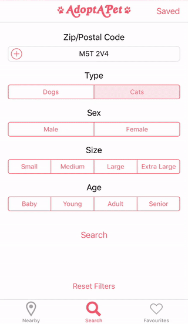
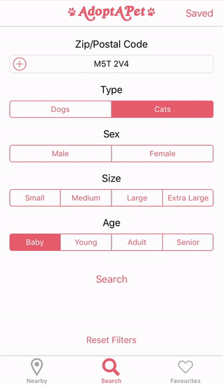

# AdoptAPet

## Overview
AdoptAPet is an iOS app that allows users to browse and search for adoptable pets from local animal shelters. This app was developed using the [Petfinder API](https://www.petfinder.com/developers/api-docs).

## Features

### Nearby

The Nearby tab shows an assortment of cats and dogs available for adoption at animal shelters close to the user. Tap on a pet to browse more photos, read a detailed description, and view contact information for the shelter.

### Search

Select species, sex, size, age, and location filters to find the perfect pet.

Switch to the map view to see where shelters are located and view their pets that match your search criteria.

Save your search filters to easily pull them up agian later.

### Favourites

Tap the heart icon to add a pet to your Favourites list.

## Tech Stack

* Objective-C
* Core Location
* MapKit
* Realm

## Future Directions

Features we would like to include in future version:
* Push notifications when new pets are added that match your saved search criteria
* Additional search filters (e.g. housebroken, has shots, has claws)

## Contributors
* [Ryan Maksymic](https://github.com/ryanmaksymic)
* [Fernando Zanei](https://github.com/fernandozanei)
